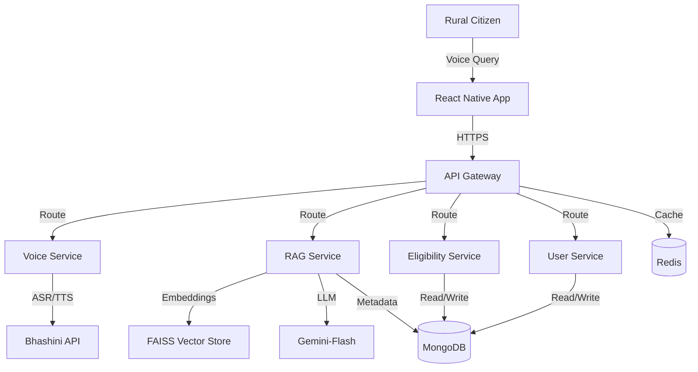

# Design Document: Samarthya Platform

## Overview

Samarthya is a microservices-based voice-first AI platform that enables rural Indian citizens to access government welfare schemes through natural voice conversations in their native languages. The platform leverages a Retrieval-Augmented Generation (RAG) architecture to provide accurate, contextual information from government policy documents while maintaining low latency and high availability.

### Key Design Principles

1. **Voice-First Experience**: All interactions prioritize voice over text, with minimal UI elements
2. **Language Inclusivity**: Support for 10+ Indian vernacular languages through Bhashini API
3. **Offline Resilience**: Critical functionality available even with poor connectivity
4. **Microservices Architecture**: Independent, scalable services for flexibility and maintainability
5. **Privacy by Design**: Encryption and data minimization throughout the system

### Technology Stack

- **Frontend**: React Native (iOS/Android)
- **API Gateway**: Node.js with Express
- **Voice Service**: Node.js with Bhashini API integration
- **RAG Service**: Python with FastAPI, LangChain, FAISS, Gemini-Flash
- **Eligibility Service**: Node.js with Express
- **User Service**: Node.js with Express
- **Database**: MongoDB (user data, queries, schemes metadata)
- **Vector Store**: FAISS (scheme document embeddings)
- **Message Queue**: Redis (for async processing and caching)

## Architecture

### High-Level Architecture



### Microservices Architecture

The platform consists of six primary services:

1. **API Gateway**: Entry point for all client requests, handles routing, authentication, rate limiting
2. **Voice Service**: Manages ASR (speech-to-text) and TTS (text-to-speech) via Bhashini API
3. **RAG Service**: Orchestrates document retrieval and response generation using LangChain
4. **Eligibility Service**: Evaluates user eligibility against scheme criteria
5. **User Service**: Manages user profiles, authentication, and preferences
6. **Mobile Application**: React Native app providing the user interface

### Data Flow Pipeline

**Complete Voice Query Flow:**

1. **Voice Input** → User speaks query in native language
2. **Audio Capture** → Mobile app captures audio and sends to API Gateway
3. **ASR Processing** → Voice Service forwards audio to Bhashini API for transcription
4. **Query Routing** → API Gateway routes transcribed text to RAG Service
5. **Embedding Generation** → RAG Service converts query to vector embedding
6. **Semantic Search** → FAISS retrieves top-k relevant scheme documents
7. **Context Assembly** → LangChain assembles query + retrieved documents as prompt
8. **LLM Generation** → Gemini-Flash generates contextual response
9. **Response Routing** → RAG Service returns text response to Voice Service
10. **TTS Processing** → Voice Service sends text to Bhashini API for speech synthesis
11. **Audio Delivery** → Synthesized audio streamed to mobile app
12. **Playback** → User hears response in native language

**Eligibility Check Flow:**

1. User query indicates eligibility check intent
2. RAG Service identifies scheme and triggers Eligibility Service
3. Eligibility Service retrieves user profile from User Service
4. Eligibility Engine evaluates user attributes against scheme criteria
5. Result returned to RAG Service for response generation
6. Response includes eligibility status and next steps

## Components and Interfaces

### 1. API Gateway

**Responsibilities:**
- Route incoming requests to appropriate microservices
- Authenticate and authorize requests using JWT tokens
- Rate limiting to prevent abuse (100 requests/minute per user)
- Request/response logging for monitoring
- Circuit breaker pattern for service failures

**Technology:** Node.js with Express, express-rate-limit, jsonwebtoken

**Key Endpoints:**

```typescript
POST /api/v1/voice/query
  Request: { audioData: Buffer, userId: string, language: string }
  Response: { audioResponse: Buffer, transcription: string, responseText: string }

POST /api/v1/eligibility/check
  Request: { userId: string, schemeId: string }
  Response: { eligible: boolean, reasons: string[], nextSteps: string[] }

GET /api/v1/user/profile
  Request: { userId: string }
  Response: { profile: UserProfile }

POST /api/v1/user/profile
  Request: { userId: string, profileData: UserProfile }
  Response: { success: boolean }

GET /api/v1/query/history
  Request: { userId: string, limit: number }
  Response: { queries: QueryHistory[] }
```

### 2. Voice Service

**Responsibilities:**
- Interface with Bhashini API for ASR and TTS
- Handle audio format conversions (mobile formats ↔ Bhashini formats)
- Manage language detection and selection
- Implement retry logic for Bhashini API failures
- Cache common TTS responses for frequently asked questions

**Technology:** Node.js with Express, axios, fluent-ffmpeg

**Bhashini API Integration:**

```typescript
interface BhashiniASRRequest {
  audio: Buffer;
  language: string; // ISO 639-1 code
  format: 'wav' | 'mp3';
  sampleRate: number;
}

interface BhashiniASRResponse {
  transcription: string;
  confidence: number;
  language: string;
}

interface BhashiniTTSRequest {
  text: string;
  language: string;
  voice: 'male' | 'female';
  speed: number; // 0.5 to 2.0
}

interface BhashiniTTSResponse {
  audio: Buffer;
  format: 'wav';
  duration: number;
}
```

**Internal API:**

```typescript
POST /voice/asr
  Request: { audio: Buffer, language: string }
  Response: { text: string, confidence: number }

POST /voice/tts
  Request: { text: string, language: string }
  Response: { audio: Buffer, duration: number }

GET /voice/languages
  Response: { languages: LanguageInfo[] }
```

### 3. RAG Service

**Responsibilities:**
- Orchestrate the RAG pipeline using LangChain
- Generate embeddings for queries and documents
- Perform semantic search in FAISS vector store
- Manage LLM interactions with Gemini-Flash
- Implement prompt engineering for accurate responses
- Handle document ingestion and indexing

**Technology:** Python with FastAPI, LangChain, FAISS, Google Generative AI SDK

**RAG Pipeline Architecture:**

```python
# LangChain RAG Pipeline
class SamarthyaRAGPipeline:
    def __init__(self):
        self.embeddings = GoogleGenerativeAIEmbeddings(model="models/embedding-001")
        self.vector_store = FAISS.load_local("scheme_embeddings")
        self.llm = ChatGoogleGenerativeAI(model="gemini-flash")
        self.retriever = self.vector_store.as_retriever(search_kwargs={"k": 5})
        
    def process_query(self, query: str, language: str) -> str:
        # 1. Retrieve relevant documents
        docs = self.retriever.get_relevant_documents(query)
        
        # 2. Assemble prompt with context
        prompt = self._build_prompt(query, docs, language)
        
        # 3. Generate response
        response = self.llm.invoke(prompt)
        
        return response.content
```

**Internal API:**

```python
POST /rag/query
  Request: { query: str, language: str, userId: str }
  Response: { response: str, sources: List[str], confidence: float }

POST /rag/ingest
  Request: { document: bytes, metadata: dict }
  Response: { documentId: str, embeddingsCount: int }

GET /rag/search
  Request: { query: str, limit: int }
  Response: { documents: List[Document] }
```

**Prompt Template:**

```python
PROMPT_TEMPLATE = """You are Samarthya, an AI assistant helping rural Indian citizens access government welfare schemes.

Context from government scheme documents:
{context}

User Question: {question}

Instructions:
1. Answer based ONLY on the provided context
2. If the answer is not in the context, say "I don't have information about that specific scheme"
3. Be concise and use simple language
4. If eligibility criteria are mentioned, list them clearly
5. Provide actionable next steps when applicable

Answer in {language}:"""
```

### 4. Eligibility Service

**Responsibilities:**
- Evaluate user eligibility against scheme criteria
- Manage eligibility rules engine
- Store and retrieve eligibility records
- Provide detailed eligibility explanations

**Technology:** Node.js with Express, MongoDB

**Eligibility Rules Engine:**

```typescript
interface EligibilityRule {
  field: string; // 'age' | 'income' | 'caste' | 'gender' | 'location'
  operator: 'eq' | 'gt' | 'lt' | 'gte' | 'lte' | 'in' | 'contains';
  value: any;
  required: boolean;
}

interface SchemeEligibility {
  schemeId: string;
  rules: EligibilityRule[];
  logic: 'AND' | 'OR'; // How to combine rules
}

class EligibilityEngine {
  evaluateEligibility(userProfile: UserProfile, scheme: SchemeEligibility): EligibilityResult {
    const results = scheme.rules.map(rule => this.evaluateRule(userProfile, rule));
    
    const eligible = scheme.logic === 'AND' 
      ? results.every(r => r.passed)
      : results.some(r => r.passed);
    
    return {
      eligible,
      passedRules: results.filter(r => r.passed),
      failedRules: results.filter(r => !r.passed),
      reasons: this.generateReasons(results)
    };
  }
}
```

**Internal API:**

```typescript
POST /eligibility/evaluate
  Request: { userId: string, schemeId: string }
  Response: { eligible: boolean, reasons: string[], confidence: number }

GET /eligibility/schemes
  Request: { userId: string }
  Response: { eligibleSchemes: Scheme[], ineligibleSchemes: Scheme[] }

POST /eligibility/rules
  Request: { schemeId: string, rules: EligibilityRule[] }
  Response: { success: boolean }
```

### 5. User Service

**Responsibilities:**
- Manage user registration and authentication
- Store and retrieve user profiles
- Handle user preferences (language, notifications)
- Encrypt sensitive user data
- Manage query history

**Technology:** Node.js with Express, MongoDB, bcrypt, jsonwebtoken

**Internal API:**

```typescript
POST /user/register
  Request: { phoneNumber: string, language: string }
  Response: { userId: string, token: string }

POST /user/login
  Request: { phoneNumber: string, otp: string }
  Response: { token: string, profile: UserProfile }

GET /user/:userId/profile
  Response: { profile: UserProfile }

PUT /user/:userId/profile
  Request: { profileData: Partial<UserProfile> }
  Response: { success: boolean }

GET /user/:userId/history
  Request: { limit: number, offset: number }
  Response: { queries: QueryHistory[] }
```

### 6. Mobile Application (React Native)

**Responsibilities:**
- Provide voice-first user interface
- Capture and play audio
- Handle offline caching
- Display query history and scheme information
- Manage user authentication state

**Key Features:**

1. **Voice Interface Component:**
```typescript
interface VoiceInterfaceProps {
  language: string;
  onQueryComplete: (result: QueryResult) => void;
}

// Uses react-native-audio-recorder-player for audio capture
// Implements visual feedback during recording and playback
```

2. **Offline Cache Manager:**
```typescript
// Uses AsyncStorage for local data persistence
// Caches top 50 schemes and user's recent queries
// Syncs when connectivity restored
```

3. **Language Selector:**
```typescript
// Prominent language selection on first launch
// Easy language switching in settings
// Supports 10 Indian languages
```

## Data Models

### User Profile

```typescript
interface UserProfile {
  userId: string;
  phoneNumber: string; // Encrypted
  age: number;
  gender: 'male' | 'female' | 'other';
  income: number; // Annual income in INR
  location: {
    state: string;
    district: string;
    block: string;
    village: string;
  };
  casteCategory: 'general' | 'obc' | 'sc' | 'st' | 'ews';
  preferredLanguage: string; // ISO 639-1 code
  createdAt: Date;
  updatedAt: Date;
  encryptedFields: string[]; // List of encrypted field names
}
```

### Scheme Document

```typescript
interface SchemeDocument {
  schemeId: string;
  name: string;
  nameTranslations: Record<string, string>; // language -> translated name
  description: string;
  descriptionTranslations: Record<string, string>;
  ministry: string;
  category: 'agriculture' | 'education' | 'health' | 'housing' | 'employment' | 'pension' | 'other';
  eligibilityCriteria: EligibilityRule[];
  benefits: string[];
  applicationProcess: string[];
  requiredDocuments: string[];
  officialUrl: string;
  lastUpdated: Date;
  active: boolean;
  embeddingIds: string[]; // References to FAISS embeddings
}
```

### Query History

```typescript
interface QueryHistory {
  queryId: string;
  userId: string;
  transcription: string;
  responseText: string;
  language: string;
  schemesReferenced: string[]; // schemeIds
  eligibilityChecked: boolean;
  feedbackRating: 'helpful' | 'not_helpful' | null;
  feedbackComment: string | null;
  timestamp: Date;
  processingTime: number; // milliseconds
}
```

### Eligibility Record

```typescript
interface EligibilityRecord {
  recordId: string;
  userId: string;
  schemeId: string;
  eligible: boolean;
  evaluationDate: Date;
  userProfileSnapshot: Partial<UserProfile>; // Profile at time of evaluation
  passedCriteria: string[];
  failedCriteria: string[];
  confidence: number; // 0-1
}
```

### Vector Store Document

```python
# FAISS stores embeddings with metadata
class VectorDocument:
    embedding: List[float]  # 768-dimensional vector from embedding model
    metadata: dict = {
        'scheme_id': str,
        'chunk_id': str,  # For large documents split into chunks
        'text': str,  # Original text
        'language': str,
        'section': str  # 'eligibility' | 'benefits' | 'process' | 'general'
    }
```


## Database Schema

### MongoDB Collections

**users Collection:**
```javascript
{
  _id: ObjectId,
  userId: String (indexed, unique),
  phoneNumber: String (encrypted, indexed),
  age: Number,
  gender: String,
  income: Number,
  location: {
    state: String,
    district: String,
    block: String,
    village: String
  },
  casteCategory: String,
  preferredLanguage: String,
  createdAt: Date,
  updatedAt: Date
}
```

**schemes Collection:**
```javascript
{
  _id: ObjectId,
  schemeId: String (indexed, unique),
  name: String,
  nameTranslations: Object,
  description: String,
  descriptionTranslations: Object,
  ministry: String,
  category: String (indexed),
  eligibilityCriteria: Array,
  benefits: Array,
  applicationProcess: Array,
  requiredDocuments: Array,
  officialUrl: String,
  lastUpdated: Date,
  active: Boolean (indexed),
  embeddingIds: Array
}
```

**queries Collection:**
```javascript
{
  _id: ObjectId,
  queryId: String (indexed, unique),
  userId: String (indexed),
  transcription: String,
  responseText: String,
  language: String,
  schemesReferenced: Array,
  eligibilityChecked: Boolean,
  feedbackRating: String,
  feedbackComment: String,
  timestamp: Date (indexed),
  processingTime: Number
}
```

**eligibility_records Collection:**
```javascript
{
  _id: ObjectId,
  recordId: String (indexed, unique),
  userId: String (indexed),
  schemeId: String (indexed),
  eligible: Boolean,
  evaluationDate: Date (indexed),
  userProfileSnapshot: Object,
  passedCriteria: Array,
  failedCriteria: Array,
  confidence: Number
}
```

### Indexes

```javascript
// Performance-critical indexes
db.users.createIndex({ userId: 1 }, { unique: true });
db.users.createIndex({ phoneNumber: 1 });
db.schemes.createIndex({ schemeId: 1 }, { unique: true });
db.schemes.createIndex({ category: 1, active: 1 });
db.queries.createIndex({ userId: 1, timestamp: -1 });
db.eligibility_records.createIndex({ userId: 1, schemeId: 1 });
```

## REST API Contracts

### API Gateway Endpoints

**1. Voice Query Endpoint**

```
POST /api/v1/voice/query
Authorization: Bearer <JWT_TOKEN>
Content-Type: multipart/form-data

Request:
{
  audioData: <binary>,
  userId: "user_123",
  language: "hi" // ISO 639-1 code
}

Response (200 OK):
{
  queryId: "query_456",
  transcription: "मुझे किसान सम्मान निधि के बारे में बताएं",
  responseText: "प्रधानमंत्री किसान सम्मान निधि योजना...",
  audioResponse: <binary>,
  schemesReferenced: ["scheme_789"],
  processingTime: 8500
}

Error Responses:
400 Bad Request - Invalid audio format or missing parameters
401 Unauthorized - Invalid or expired token
429 Too Many Requests - Rate limit exceeded
500 Internal Server Error - Service failure
```

**2. Eligibility Check Endpoint**

```
POST /api/v1/eligibility/check
Authorization: Bearer <JWT_TOKEN>
Content-Type: application/json

Request:
{
  userId: "user_123",
  schemeId: "scheme_789"
}

Response (200 OK):
{
  eligible: true,
  confidence: 0.95,
  reasons: [
    "Age requirement met (35 years)",
    "Income below threshold (₹2,00,000 < ₹2,50,000)",
    "Location eligible (Uttar Pradesh)"
  ],
  nextSteps: [
    "Visit nearest Common Service Center",
    "Bring Aadhaar card and income certificate",
    "Fill application form PM-KISAN-001"
  ],
  requiredDocuments: [
    "Aadhaar Card",
    "Bank Account Details",
    "Land Ownership Documents"
  ]
}

Response (200 OK - Not Eligible):
{
  eligible: false,
  confidence: 1.0,
  reasons: [
    "Income exceeds threshold (₹3,00,000 > ₹2,50,000)"
  ],
  alternativeSchemes: ["scheme_101", "scheme_202"]
}
```

**3. User Profile Endpoints**

```
GET /api/v1/user/profile
Authorization: Bearer <JWT_TOKEN>

Response (200 OK):
{
  userId: "user_123",
  age: 35,
  gender: "male",
  income: 200000,
  location: {
    state: "Uttar Pradesh",
    district: "Varanasi",
    block: "Pindra",
    village: "Rampur"
  },
  casteCategory: "obc",
  preferredLanguage: "hi",
  createdAt: "2024-01-15T10:30:00Z",
  updatedAt: "2024-01-20T14:45:00Z"
}
```

```
PUT /api/v1/user/profile
Authorization: Bearer <JWT_TOKEN>
Content-Type: application/json

Request:
{
  age: 36,
  income: 220000,
  location: {
    state: "Uttar Pradesh",
    district: "Varanasi",
    block: "Pindra",
    village: "Rampur"
  }
}

Response (200 OK):
{
  success: true,
  updatedFields: ["age", "income"],
  profile: { /* updated profile */ }
}
```

**4. Query History Endpoint**

```
GET /api/v1/query/history?limit=20&offset=0
Authorization: Bearer <JWT_TOKEN>

Response (200 OK):
{
  queries: [
    {
      queryId: "query_456",
      transcription: "मुझे किसान सम्मान निधि के बारे में बताएं",
      responseText: "प्रधानमंत्री किसान सम्मान निधि योजना...",
      language: "hi",
      schemesReferenced: ["scheme_789"],
      feedbackRating: "helpful",
      timestamp: "2024-01-20T15:30:00Z"
    }
  ],
  total: 45,
  limit: 20,
  offset: 0
}
```

**5. Feedback Endpoint**

```
POST /api/v1/query/feedback
Authorization: Bearer <JWT_TOKEN>
Content-Type: application/json

Request:
{
  queryId: "query_456",
  rating: "helpful", // or "not_helpful"
  comment: "Very clear explanation"
}

Response (200 OK):
{
  success: true,
  queryId: "query_456"
}
```

### Internal Service APIs

**Voice Service Internal API:**

```
POST /internal/voice/asr
Content-Type: application/json

Request:
{
  audio: <base64_encoded_audio>,
  language: "hi",
  format: "wav",
  sampleRate: 16000
}

Response:
{
  transcription: "मुझे किसान सम्मान निधि के बारे में बताएं",
  confidence: 0.92,
  language: "hi",
  processingTime: 2800
}
```

```
POST /internal/voice/tts
Content-Type: application/json

Request:
{
  text: "प्रधानमंत्री किसान सम्मान निधि योजना...",
  language: "hi",
  voice: "female",
  speed: 1.0
}

Response:
{
  audio: <base64_encoded_audio>,
  format: "wav",
  duration: 15.5,
  processingTime: 1200
}
```

**RAG Service Internal API:**

```
POST /internal/rag/query
Content-Type: application/json

Request:
{
  query: "Tell me about PM Kisan Samman Nidhi",
  language: "en",
  userId: "user_123",
  maxDocuments: 5
}

Response:
{
  response: "PM Kisan Samman Nidhi is a central sector scheme...",
  sources: [
    {
      schemeId: "scheme_789",
      schemeName: "PM-KISAN",
      relevanceScore: 0.95,
      excerpt: "..."
    }
  ],
  confidence: 0.88,
  processingTime: 4200
}
```

**Eligibility Service Internal API:**

```
POST /internal/eligibility/evaluate
Content-Type: application/json

Request:
{
  userId: "user_123",
  schemeId: "scheme_789"
}

Response:
{
  eligible: true,
  confidence: 0.95,
  passedRules: [
    { field: "age", operator: "gte", value: 18, userValue: 35 },
    { field: "income", operator: "lte", value: 250000, userValue: 200000 }
  ],
  failedRules: [],
  reasons: ["Age requirement met", "Income below threshold"]
}
```

## Authentication and Security

### JWT Token Structure

```javascript
{
  header: {
    alg: "HS256",
    typ: "JWT"
  },
  payload: {
    userId: "user_123",
    phoneNumber: "encrypted_phone",
    role: "citizen",
    iat: 1705756800,
    exp: 1705843200 // 24 hour expiration
  },
  signature: "..."
}
```

### Encryption Strategy

1. **Data at Rest:**
   - Sensitive fields (phoneNumber, income) encrypted using AES-256
   - Encryption keys stored in environment variables, rotated quarterly
   - MongoDB field-level encryption for PII

2. **Data in Transit:**
   - All API communication over HTTPS/TLS 1.3
   - Certificate pinning in mobile app
   - Bhashini API calls over HTTPS

3. **Authentication Flow:**
   - OTP-based authentication via SMS
   - JWT tokens with 24-hour expiration
   - Refresh tokens stored securely in mobile app keychain

### Rate Limiting

```javascript
// API Gateway rate limits
const rateLimits = {
  voiceQuery: { windowMs: 60000, max: 10 }, // 10 queries per minute
  eligibilityCheck: { windowMs: 60000, max: 20 },
  profileUpdate: { windowMs: 3600000, max: 5 }, // 5 updates per hour
  queryHistory: { windowMs: 60000, max: 30 }
};
```

## Performance Optimization

### Caching Strategy

**Redis Cache Layers:**

1. **TTS Response Cache:**
   - Cache frequently asked questions' audio responses
   - TTL: 7 days
   - Key format: `tts:{language}:{text_hash}`

2. **Scheme Metadata Cache:**
   - Cache scheme information to reduce MongoDB queries
   - TTL: 1 hour
   - Key format: `scheme:{schemeId}`

3. **User Profile Cache:**
   - Cache active user profiles
   - TTL: 15 minutes
   - Key format: `user:{userId}`

4. **RAG Results Cache:**
   - Cache common query results
   - TTL: 1 hour
   - Key format: `rag:{query_hash}:{language}`

### Database Optimization

1. **Connection Pooling:**
   - MongoDB connection pool size: 50
   - Connection timeout: 5 seconds

2. **Query Optimization:**
   - Compound indexes for common query patterns
   - Projection to fetch only required fields
   - Aggregation pipelines for complex queries

3. **Sharding Strategy:**
   - Shard queries collection by userId (horizontal scaling)
   - Shard schemes collection by category

### FAISS Optimization

1. **Index Type:** IVF (Inverted File Index) with PQ (Product Quantization)
2. **Configuration:**
   - nlist: 100 (number of clusters)
   - nprobe: 10 (clusters to search)
   - Dimension: 768 (embedding size)

3. **Performance:**
   - Search time: <100ms for 10,000+ documents
   - Memory footprint: ~2GB for 50,000 scheme chunks


## Correctness Properties

*A property is a characteristic or behavior that should hold true across all valid executions of a system—essentially, a formal statement about what the system should do. Properties serve as the bridge between human-readable specifications and machine-verifiable correctness guarantees.*

### Property Reflection and Consolidation

After analyzing all acceptance criteria, several properties can be consolidated to avoid redundancy:

- **Service Communication Properties**: Multiple criteria test that services forward data to each other (1.2, 1.5, 2.4, 4.1). These can be consolidated into a general inter-service communication property.
- **Data Persistence Properties**: Multiple criteria test that data is stored (3.6, 5.2, 12.1, 15.2). These share the same underlying property about persistence.
- **Validation Properties**: Multiple criteria test input validation (1.3, 3.2, 5.2). These can be consolidated into validation completeness properties.
- **Round-Trip Properties**: User profile storage/retrieval (5.3, 5.4) and language translation (8.4, 8.5) are round-trip properties.
- **Error Handling Properties**: Multiple criteria test error responses (1.4, 4.5, 13.1-13.4). These share common error handling patterns.

### Voice Input and Processing Properties

**Property 1: Audio Capture Initiation**
*For any* voice query trigger event, the Voice_Service should initiate audio capture from the device microphone.
**Validates: Requirements 1.1**

**Property 2: ASR API Invocation**
*For any* captured audio buffer, the Voice_Service should send the audio to Bhashini_API with the correct language parameter.
**Validates: Requirements 1.2**

**Property 3: Transcription Validation**
*For any* transcription response from Bhashini_API, the Voice_Service should reject empty or whitespace-only strings.
**Validates: Requirements 1.3**

**Property 4: Retry Prompt on Invalid Transcription**
*For any* empty or invalid transcription, the Voice_Service should generate a retry prompt in the user's language.
**Validates: Requirements 1.4**

**Property 5: Query Forwarding**
*For any* valid transcription, the Voice_Service should forward the text to RAG_Service for processing.
**Validates: Requirements 1.5**

### Semantic Search and RAG Properties

**Property 6: Query Embedding Generation**
*For any* user query string, the RAG_Service should generate a vector embedding of the configured dimension (768).
**Validates: Requirements 2.1**

**Property 7: Vector Search Execution**
*For any* query embedding, the RAG_Service should perform a similarity search in the FAISS Vector_Store.
**Validates: Requirements 2.2**

**Property 8: Top-K Retrieval**
*For any* vector search, the RAG_Service should retrieve at most 5 documents, or all available documents if fewer than 5 exist.
**Validates: Requirements 2.3**

**Property 9: LLM Context Assembly**
*For any* retrieved documents and query, the RAG_Service should assemble a prompt containing both the query and document context before invoking the LLM.
**Validates: Requirements 2.4**

**Property 10: Response Grounding**
*For any* LLM-generated response, the response should contain information that can be traced back to at least one of the retrieved source documents.
**Validates: Requirements 2.5**

### Eligibility Determination Properties

**Property 11: Eligibility Data Request**
*For any* eligibility check query, the Eligibility_Engine should request user demographic data from the User_Service.
**Validates: Requirements 3.1**

**Property 12: Required Fields Validation**
*For any* user profile used in eligibility evaluation, all required fields (age, income, location, caste category, gender) should be present and non-null.
**Validates: Requirements 3.2**

**Property 13: Criteria Evaluation Completeness**
*For any* scheme eligibility check, the Eligibility_Engine should evaluate all defined eligibility rules for that scheme.
**Validates: Requirements 3.3**

**Property 14: Positive Eligibility Result**
*For any* user profile that satisfies all eligibility rules for a scheme, the Eligibility_Engine should return eligible=true with application instructions.
**Validates: Requirements 3.4**

**Property 15: Negative Eligibility with Reasons**
*For any* user profile that fails at least one eligibility rule, the Eligibility_Engine should return eligible=false with specific reasons for each failed rule.
**Validates: Requirements 3.5**

**Property 16: Eligibility Record Persistence**
*For any* completed eligibility evaluation, an eligibility record should be stored in the database with userId, schemeId, result, and timestamp.
**Validates: Requirements 3.6**

### Voice Output Properties

**Property 17: TTS API Invocation**
*For any* text response generated by RAG_Service, the Voice_Service should send the text to Bhashini_API for TTS conversion with the user's selected language.
**Validates: Requirements 4.2**

**Property 18: Audio Streaming**
*For any* synthesized audio returned by Bhashini_API, the Voice_Service should stream the audio to the client device.
**Validates: Requirements 4.3**

**Property 19: TTS Retry Logic**
*For any* TTS API failure, the Voice_Service should retry exactly once before returning an error.
**Validates: Requirements 4.5**

**Property 20: Follow-up Prompt**
*For any* completed audio playback, the Voice_Service should generate a follow-up prompt asking if the user has additional questions.
**Validates: Requirements 4.6**

### User Profile Management Properties

**Property 21: Unique Profile Creation**
*For any* new user registration, the User_Service should create a profile with a unique userId that doesn't conflict with existing users.
**Validates: Requirements 5.1**

**Property 22: Profile Data Validation**
*For any* user profile submission, the User_Service should validate that age is positive, income is non-negative, and all required location fields are present.
**Validates: Requirements 5.2**

**Property 23: PII Encryption**
*For any* user profile stored in the database, sensitive fields (phoneNumber, income) should be encrypted using AES-256.
**Validates: Requirements 5.3**

**Property 24: Profile Round-Trip**
*For any* user profile stored in the database, retrieving the profile and decrypting sensitive fields should yield data equivalent to the original submission.
**Validates: Requirements 5.4**

**Property 25: Profile Update Validation**
*For any* profile update request, the User_Service should validate the new data before persisting changes to the database.
**Validates: Requirements 5.5**

**Property 26: Authentication-Based Access Control**
*For any* user profile access request, the User_Service should verify the requesting user's authentication token matches the profile's userId.
**Validates: Requirements 5.6**

### Offline Capability Properties

**Property 27: Scheme Caching**
*For any* online session, the mobile application should cache scheme documents that are accessed, up to the configured cache limit.
**Validates: Requirements 6.1**

**Property 28: Offline Notification**
*For any* transition to offline status, the mobile application should display a notification indicating limited functionality.
**Validates: Requirements 6.2**

**Property 29: Cached Data Access**
*For any* scheme that has been cached, the mobile application should be able to retrieve and display the scheme information while offline.
**Validates: Requirements 6.3**

**Property 30: Query Queuing**
*For any* voice query submitted while offline, the mobile application should add the query to a local queue for later processing.
**Validates: Requirements 6.4**

**Property 31: Sync on Reconnection**
*For any* queued queries when connectivity is restored, the mobile application should automatically submit them to the backend for processing.
**Validates: Requirements 6.5**

### Multi-Language Support Properties

**Property 32: Language Configuration Persistence**
*For any* language selection by a user, all subsequent voice interactions (ASR and TTS) should use the selected language until changed.
**Validates: Requirements 8.2**

**Property 33: Query Translation for LLM**
*For any* query in a non-English vernacular language, the RAG_Service should translate the query to English before LLM processing.
**Validates: Requirements 8.4**

**Property 34: Response Language Consistency**
*For any* query submitted in language X, the final response should be generated in the same language X.
**Validates: Requirements 8.5**

**Property 35: Dynamic Language Switching**
*For any* language preference change, all subsequent interactions should immediately use the new language without requiring app restart.
**Validates: Requirements 8.6**

### Document Management Properties

**Property 36: Document Parsing**
*For any* uploaded scheme document, the RAG_Service should parse the document and extract text content regardless of format (PDF, DOCX, TXT).
**Validates: Requirements 9.1**

**Property 37: Embedding Generation**
*For any* parsed document content, the RAG_Service should generate vector embeddings for all text chunks.
**Validates: Requirements 9.2**

**Property 38: Embedding Storage with Metadata**
*For any* generated embeddings, the RAG_Service should store them in FAISS with associated metadata (schemeId, chunkId, text, section).
**Validates: Requirements 9.3**

**Property 39: Embedding Update**
*For any* scheme document update, the RAG_Service should replace all old embeddings for that schemeId with new embeddings.
**Validates: Requirements 9.4**

**Property 40: Soft Deletion**
*For any* deprecated scheme, the RAG_Service should set active=false in the database while retaining all document data and embeddings.
**Validates: Requirements 9.5**

### Security and Privacy Properties

**Property 41: Profile Encryption**
*For any* new user profile creation, PII fields should be encrypted before database insertion.
**Validates: Requirements 10.1**

**Property 42: Token Validation**
*For any* request to a protected API endpoint, the API_Gateway should validate the JWT token and reject requests with invalid or expired tokens.
**Validates: Requirements 10.2**

**Property 43: Query Anonymization**
*For any* query record older than 90 days, the system should remove or hash the userId to anonymize the query.
**Validates: Requirements 10.4**

**Property 44: Data Deletion**
*For any* user data deletion request, the User_Service should remove all associated records (profile, queries, eligibility records) from the database.
**Validates: Requirements 10.6**

### Query History Properties

**Property 45: Query Persistence**
*For any* completed voice query, the system should store a record containing transcription, response, timestamp, and schemesReferenced in the database.
**Validates: Requirements 12.1**

**Property 46: History Retrieval Limit**
*For any* query history request, the User_Service should return at most the requested limit (default 50) of the user's most recent queries.
**Validates: Requirements 12.2**

**Property 47: History Display Completeness**
*For any* query history item displayed, the response should include query text, response summary, and timestamp.
**Validates: Requirements 12.3**

**Property 48: Full Response Retrieval**
*For any* selected historical query, the system should retrieve and display the complete original response text.
**Validates: Requirements 12.4**

**Property 49: Query Re-execution**
*For any* historical query, the user should be able to re-submit it, triggering the full RAG pipeline as if it were a new query.
**Validates: Requirements 12.5**

**Property 50: Query Retention**
*For any* query record, it should be retained in the database for at least 1 year before archival or deletion.
**Validates: Requirements 12.6**

### Error Handling and Resilience Properties

**Property 51: Localized Error Messages**
*For any* external API failure (Bhashini, Gemini), the system should return an error message in the user's selected language.
**Validates: Requirements 13.1**

**Property 52: Retry with Exponential Backoff**
*For any* RAG_Service document retrieval failure, the API_Gateway should retry up to 3 times with exponentially increasing delays.
**Validates: Requirements 13.2**

**Property 53: LLM Fallback**
*For any* LLM service unavailability, the RAG_Service should return either a cached response for the query or a fallback message.
**Validates: Requirements 13.3**

**Property 54: Write Operation Queuing**
*For any* database write operation that fails due to connection issues, the User_Service should queue the operation for retry when connection is restored.
**Validates: Requirements 13.4**

**Property 55: Error Logging with Context**
*For any* service error or exception, the system should log the error with contextual information (userId, timestamp, service name, error details).
**Validates: Requirements 13.5**

### Application Guidance Properties

**Property 56: Instruction Provision**
*For any* positive eligibility result, the response should include step-by-step application instructions.
**Validates: Requirements 14.1**

**Property 57: Instruction Completeness**
*For any* application instructions provided, they should include required documents, deadlines, and submission locations.
**Validates: Requirements 14.2**

**Property 58: Voice-Guided Instructions**
*For any* application help request, the system should generate voice instructions in the user's selected language.
**Validates: Requirements 14.3**

**Property 59: Application Link Inclusion**
*For any* scheme with an online application portal, the response should include a direct URL to the portal.
**Validates: Requirements 14.4**

**Property 60: Nearest Office Location**
*For any* user requiring in-person application, the system should identify and provide the nearest government office based on the user's district.
**Validates: Requirements 14.5**

**Property 61: Offline Instruction Storage**
*For any* application instructions, the mobile app should allow saving them to local storage for offline access.
**Validates: Requirements 14.6**

### Feedback and Improvement Properties

**Property 62: Feedback Prompt**
*For any* response provided to a user, the system should prompt the user to rate the response as helpful or not helpful.
**Validates: Requirements 15.1**

**Property 63: Feedback Storage**
*For any* user rating submitted, the system should store the rating associated with the corresponding queryId.
**Validates: Requirements 15.2**

**Property 64: Negative Feedback Follow-up**
*For any* "not helpful" rating, the system should prompt the user for additional details about why the response was unhelpful.
**Validates: Requirements 15.3**

**Property 65: Feedback Aggregation**
*For any* feedback submitted, it should be included in aggregated analytics accessible to system administrators.
**Validates: Requirements 15.4**

**Property 66: Incorrect Information Flagging**
*For any* user report of incorrect information, the system should flag the associated query and response for manual review.
**Validates: Requirements 15.6**


## Error Handling

### Error Categories and Responses

**1. External API Failures (Bhashini, Gemini)**

```typescript
class ExternalAPIError extends Error {
  constructor(
    public service: 'bhashini' | 'gemini',
    public operation: 'asr' | 'tts' | 'llm',
    public originalError: Error
  ) {
    super(`${service} ${operation} failed: ${originalError.message}`);
  }
}

// Error handling strategy
async function handleExternalAPICall<T>(
  apiCall: () => Promise<T>,
  retries: number = 1
): Promise<T> {
  for (let attempt = 0; attempt <= retries; attempt++) {
    try {
      return await apiCall();
    } catch (error) {
      if (attempt === retries) {
        // Log error and return user-friendly message
        logger.error('External API call failed', { error, attempt });
        throw new ExternalAPIError(/* ... */);
      }
      // Exponential backoff
      await sleep(Math.pow(2, attempt) * 1000);
    }
  }
}
```

**2. Database Errors**

```typescript
class DatabaseError extends Error {
  constructor(
    public operation: 'read' | 'write' | 'update' | 'delete',
    public collection: string,
    public originalError: Error
  ) {
    super(`Database ${operation} failed on ${collection}`);
  }
}

// Write operation queuing for resilience
class WriteQueue {
  private queue: Array<{ operation: () => Promise<any>, retries: number }> = [];
  
  async enqueue(operation: () => Promise<any>) {
    this.queue.push({ operation, retries: 0 });
    await this.processQueue();
  }
  
  private async processQueue() {
    while (this.queue.length > 0) {
      const item = this.queue[0];
      try {
        await item.operation();
        this.queue.shift(); // Remove successful operation
      } catch (error) {
        item.retries++;
        if (item.retries >= 3) {
          logger.error('Write operation failed after 3 retries', { error });
          this.queue.shift(); // Remove failed operation
        } else {
          await sleep(5000); // Wait before retry
        }
      }
    }
  }
}
```

**3. Validation Errors**

```typescript
class ValidationError extends Error {
  constructor(
    public field: string,
    public value: any,
    public constraint: string
  ) {
    super(`Validation failed for ${field}: ${constraint}`);
  }
}

// Validation middleware
function validateUserProfile(profile: Partial<UserProfile>): ValidationError[] {
  const errors: ValidationError[] = [];
  
  if (profile.age !== undefined && (profile.age < 0 || profile.age > 150)) {
    errors.push(new ValidationError('age', profile.age, 'must be between 0 and 150'));
  }
  
  if (profile.income !== undefined && profile.income < 0) {
    errors.push(new ValidationError('income', profile.income, 'must be non-negative'));
  }
  
  // ... more validations
  
  return errors;
}
```

**4. Circuit Breaker Pattern**

```typescript
class CircuitBreaker {
  private failureCount = 0;
  private lastFailureTime: number | null = null;
  private state: 'closed' | 'open' | 'half-open' = 'closed';
  
  constructor(
    private threshold: number = 5,
    private timeout: number = 60000 // 1 minute
  ) {}
  
  async execute<T>(operation: () => Promise<T>): Promise<T> {
    if (this.state === 'open') {
      if (Date.now() - this.lastFailureTime! > this.timeout) {
        this.state = 'half-open';
      } else {
        throw new Error('Circuit breaker is open');
      }
    }
    
    try {
      const result = await operation();
      this.onSuccess();
      return result;
    } catch (error) {
      this.onFailure();
      throw error;
    }
  }
  
  private onSuccess() {
    this.failureCount = 0;
    this.state = 'closed';
  }
  
  private onFailure() {
    this.failureCount++;
    this.lastFailureTime = Date.now();
    if (this.failureCount >= this.threshold) {
      this.state = 'open';
    }
  }
}
```

### Error Response Format

All API errors follow a consistent format:

```typescript
interface ErrorResponse {
  error: {
    code: string; // e.g., 'BHASHINI_ASR_FAILED'
    message: string; // User-friendly message in user's language
    details?: any; // Additional context for debugging
    timestamp: string;
    requestId: string;
  };
}

// Example error responses
{
  error: {
    code: 'BHASHINI_ASR_FAILED',
    message: 'आपकी आवाज़ को समझने में समस्या हुई। कृपया दोबारा प्रयास करें।',
    details: { service: 'bhashini', operation: 'asr' },
    timestamp: '2024-01-20T15:30:00Z',
    requestId: 'req_abc123'
  }
}
```

### Graceful Degradation

When services are unavailable, the system provides degraded but functional service:

1. **LLM Unavailable**: Return cached responses for common queries
2. **Bhashini Unavailable**: Display text responses with apology message
3. **Database Unavailable**: Queue writes, serve cached reads
4. **Vector Store Unavailable**: Use keyword-based search fallback

## Testing Strategy

### Dual Testing Approach

The Samarthya platform requires both unit testing and property-based testing for comprehensive coverage:

- **Unit Tests**: Verify specific examples, edge cases, and integration points
- **Property Tests**: Verify universal properties across all inputs using randomized testing

### Property-Based Testing Configuration

**Testing Library**: We will use **fast-check** for JavaScript/TypeScript services and **Hypothesis** for Python services.

**Configuration**:
- Minimum 100 iterations per property test
- Each property test references its design document property
- Tag format: `Feature: samarthya-platform, Property {number}: {property_text}`

**Example Property Test (TypeScript with fast-check)**:

```typescript
import fc from 'fast-check';

describe('Voice Service - Property Tests', () => {
  // Feature: samarthya-platform, Property 3: Transcription Validation
  it('should reject empty or whitespace-only transcriptions', () => {
    fc.assert(
      fc.property(
        fc.string().filter(s => s.trim() === ''), // Generate whitespace strings
        (transcription) => {
          const result = voiceService.validateTranscription(transcription);
          expect(result.valid).toBe(false);
          expect(result.error).toBeDefined();
        }
      ),
      { numRuns: 100 }
    );
  });
  
  // Feature: samarthya-platform, Property 24: Profile Round-Trip
  it('should preserve user profile data through store and retrieve', () => {
    fc.assert(
      fc.property(
        fc.record({
          age: fc.integer({ min: 18, max: 100 }),
          income: fc.integer({ min: 0, max: 10000000 }),
          gender: fc.constantFrom('male', 'female', 'other'),
          casteCategory: fc.constantFrom('general', 'obc', 'sc', 'st', 'ews')
        }),
        async (profile) => {
          const userId = await userService.createProfile(profile);
          const retrieved = await userService.getProfile(userId);
          
          expect(retrieved.age).toBe(profile.age);
          expect(retrieved.income).toBe(profile.income);
          expect(retrieved.gender).toBe(profile.gender);
          expect(retrieved.casteCategory).toBe(profile.casteCategory);
        }
      ),
      { numRuns: 100 }
    );
  });
});
```

**Example Property Test (Python with Hypothesis)**:

```python
from hypothesis import given, strategies as st
import pytest

# Feature: samarthya-platform, Property 8: Top-K Retrieval
@given(
    query=st.text(min_size=1, max_size=200),
    num_docs=st.integers(min_value=0, max_value=100)
)
def test_top_k_retrieval(query, num_docs):
    """For any vector search, should retrieve at most 5 documents"""
    # Setup: Create vector store with num_docs documents
    vector_store = create_test_vector_store(num_docs)
    
    # Execute
    results = rag_service.search(query, k=5)
    
    # Verify
    expected_count = min(5, num_docs)
    assert len(results) == expected_count
    
# Feature: samarthya-platform, Property 10: Response Grounding
@given(
    query=st.text(min_size=10, max_size=100),
    documents=st.lists(st.text(min_size=50, max_size=500), min_size=1, max_size=5)
)
def test_response_grounding(query, documents):
    """For any LLM response, it should contain info from source documents"""
    # Execute
    response = rag_service.generate_response(query, documents)
    
    # Verify: Response should contain keywords from at least one document
    response_lower = response.lower()
    grounded = any(
        any(word in response_lower for word in doc.lower().split()[:10])
        for doc in documents
    )
    assert grounded, "Response not grounded in source documents"
```

### Unit Testing Strategy

**Unit tests focus on**:
1. Specific examples demonstrating correct behavior
2. Edge cases (empty inputs, boundary values, special characters)
3. Error conditions (API failures, invalid data, timeouts)
4. Integration points between services

**Example Unit Tests**:

```typescript
describe('Eligibility Engine - Unit Tests', () => {
  it('should return eligible for user meeting all PM-KISAN criteria', async () => {
    const user = {
      age: 35,
      income: 200000,
      location: { state: 'Uttar Pradesh', district: 'Varanasi' },
      casteCategory: 'obc'
    };
    const scheme = schemes.PM_KISAN;
    
    const result = await eligibilityEngine.evaluate(user, scheme);
    
    expect(result.eligible).toBe(true);
    expect(result.reasons).toContain('Age requirement met');
    expect(result.reasons).toContain('Income below threshold');
  });
  
  it('should handle empty scheme document list gracefully', async () => {
    const query = 'Tell me about schemes';
    const emptyDocs = [];
    
    const response = await ragService.generateResponse(query, emptyDocs);
    
    expect(response).toContain('no matching schemes');
  });
  
  it('should retry TTS exactly once on failure', async () => {
    const mockBhashini = jest.fn()
      .mockRejectedValueOnce(new Error('TTS failed'))
      .mockResolvedValueOnce({ audio: Buffer.from('audio') });
    
    await voiceService.synthesizeSpeech('test', 'hi');
    
    expect(mockBhashini).toHaveBeenCalledTimes(2);
  });
});
```

### Integration Testing

**Integration tests verify**:
1. End-to-end voice query flow
2. Service-to-service communication
3. Database operations with real MongoDB instance
4. External API mocking (Bhashini, Gemini)

```typescript
describe('End-to-End Voice Query Flow', () => {
  it('should process a complete voice query from audio to response', async () => {
    // Setup
    const audioBuffer = fs.readFileSync('test/fixtures/hindi_query.wav');
    const userId = 'test_user_123';
    
    // Mock external APIs
    mockBhashiniASR.mockResolvedValue({
      transcription: 'मुझे किसान योजना के बारे में बताएं',
      confidence: 0.9
    });
    mockGemini.mockResolvedValue({
      response: 'प्रधानमंत्री किसान सम्मान निधि योजना...'
    });
    mockBhashiniTTS.mockResolvedValue({
      audio: Buffer.from('response_audio')
    });
    
    // Execute
    const response = await apiGateway.processVoiceQuery({
      audioData: audioBuffer,
      userId,
      language: 'hi'
    });
    
    // Verify
    expect(response.transcription).toBe('मुझे किसान योजना के बारे में बताएं');
    expect(response.responseText).toContain('किसान सम्मान निधि');
    expect(response.audioResponse).toBeDefined();
    expect(response.processingTime).toBeLessThan(10000);
  });
});
```

### Test Coverage Goals

- **Unit Test Coverage**: Minimum 80% code coverage
- **Property Test Coverage**: All 66 correctness properties implemented
- **Integration Test Coverage**: All critical user flows (voice query, eligibility check, profile management)
- **E2E Test Coverage**: Top 10 user scenarios

### Testing Infrastructure

**CI/CD Pipeline**:
1. Run unit tests on every commit
2. Run property tests on every PR
3. Run integration tests before deployment
4. Run E2E tests in staging environment

**Test Data Management**:
- Synthetic scheme documents for testing
- Anonymized user profiles for integration tests
- Recorded audio samples for voice testing
- Mock responses for external APIs

### Performance Testing

While not part of unit/property testing, performance testing validates latency requirements:

- Load testing: 10,000 concurrent users
- Stress testing: Gradual load increase to find breaking point
- Latency testing: P95 latency < 10 seconds for voice queries
- Database performance: Query response times under load

